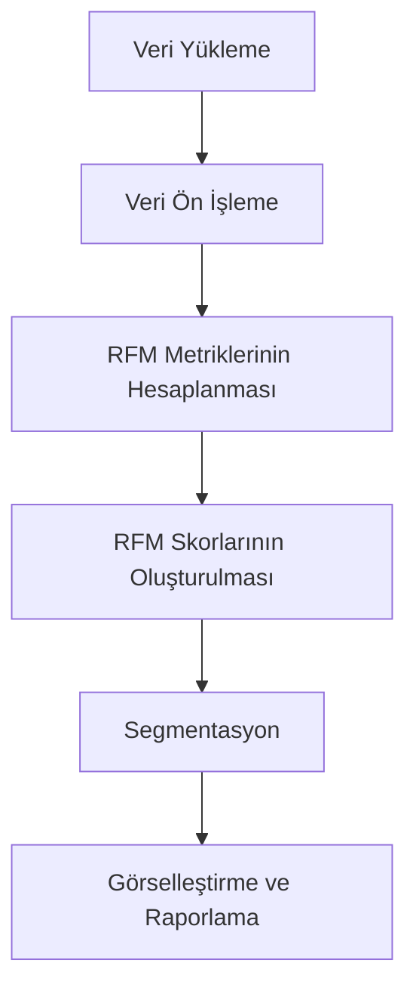

# 📌 RFM Analizi Projesi

## 🔎 Kısa Açıklama
Bu proje, müşteri segmentasyonu amacıyla **RFM (Recency, Frequency, Monetary)** analizi gerçekleştirmektedir. Müşteri davranışları satın alma sıklığı, son satın alma tarihi ve harcama tutarına göre analiz edilmiştir. Sonuçta müşteriler farklı segmentlere ayrılarak işletmeye yönelik pazarlama stratejilerinde kullanılabilecek içgörüler sunulmuştur.

---

## 📂 İçindekiler
- [📌 Proje Başlığı](#-rfm-analizi-projesi)
- [🔎 Kısa Açıklama](#-kısa-açıklama)
- [⚙️ Kurulum](#️-kurulum)
- [▶️ Kullanım](#️-kullanım)
- [🌟 Özellikler](#-özellikler)
- [📊 Çıktılar](#-çıktılar)
- [📈 Çalışma Akışı](#-çalışma-akışı)

---

## ⚙️ Kurulum

1. Gerekli kütüphaneleri yükleyin:
```bash
pip install pandas numpy matplotlib seaborn jupyter
```

2. Projeyi indirin veya klonlayın:
```bash
git clone https://github.com/kullanici/rfm-analizi.git
cd rfm-analizi
```

3. Jupyter Notebook ortamında açın:
```bash
jupyter notebook rfm.ipynb
```

---

## ▶️ Kullanım

1. `rfm.ipynb` dosyasını Jupyter Notebook ile açın.  
2. Kod hücrelerini sırayla çalıştırarak verilerin nasıl işlendiğini ve segmentasyonun nasıl yapıldığını gözlemleyin.  
3. Kendi veri setinizi kullanmak için Notebook içindeki **veri yükleme kısmını** değiştirin.

Örnek kod parçası:
```python
import pandas as pd

df = pd.read_csv("online_retail.csv")
# RFM analizi adımları burada çalıştırılır
```

---

## 🌟 Özellikler

- 📊 Müşteri segmentasyonu için RFM (Recency, Frequency, Monetary) analizi
- 🔍 Müşteri davranışlarını inceleme ve gruplama
- 📈 Görselleştirme desteği (Matplotlib / Seaborn)
- 🛠 Jupyter Notebook ortamında adım adım çalıştırılabilir
- 🔗 Kolayca farklı veri setlerine uyarlanabilir
- 📑 Segment bazlı raporlama imkanı

---

## 📊 Çıktılar

- RFM değerleri üzerinden müşteri segmentlerinin oluşturulması  
- Segmentlere göre müşteri dağılımı ve harcama eğilimlerinin görselleştirilmesi  
- Pazarlama stratejilerine yönelik uygulanabilir içgörüler

Örnek görselleştirme:
```python
import seaborn as sns
import matplotlib.pyplot as plt

sns.histplot(df["recency"])
plt.title("Müşteri Yenilik Dağılımı")
plt.show()
```

---

## 📈 Çalışma Akışı



---
