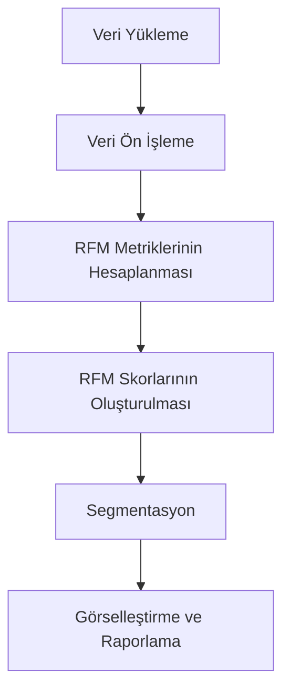

# 📌 RFM ile Müşteri Segmentasyonu (Customer Segmentation with RFM)


---


## 💼 İş Problemi (Business Problem)
FLO müşterilerini segmentlere ayırıp bu segmentlere göre pazarlama stratejileri belirlemek istiyor.
Buna yönelik olarak müşterilerin davranışları tanımlanacak ve bu davranış öbeklenmelerine göre gruplar oluşturulacak.


---


## 📊 Veri Seti Hikayesi
Veri seti, son alışverişlerini 2020 - 2021 yıllarında **OmniChannel** (hem online hem offline alışveriş yapan) olarak yapan müşterilerin geçmiş alışveriş davranışlarından elde edilen bilgilerden oluşmaktadır.


**Değişkenler:**
- `master_id`: Eşsiz müşteri numarası
- `order_channel`: Alışveriş yapılan platforma ait kanal (Android, iOS, Desktop, Mobile, Offline)
- `last_order_channel`: En son alışverişin yapıldığı kanal
- `first_order_date`: Müşterinin yaptığı ilk alışveriş tarihi
- `last_order_date`: Müşterinin yaptığı son alışveriş tarihi
- `last_order_date_online`: Müşterinin online platformda yaptığı son alışveriş tarihi
- `last_order_date_offline`: Müşterinin offline platformda yaptığı son alışveriş tarihi
- `order_num_total_ever_online`: Müşterinin online platformda yaptığı toplam alışveriş sayısı
- `order_num_total_ever_offline`: Müşterinin offline platformda yaptığı toplam alışveriş sayısı
- `customer_value_total_ever_offline`: Müşterinin offline alışverişlerinde ödediği toplam ücret
- `customer_value_total_ever_online`: Müşterinin online alışverişlerinde ödediği toplam ücret
- `interested_in_categories_12`: Müşterinin son 12 ayda alışveriş yaptığı kategorilerin listesi

---

## ⚙️ Kurulum

1. Gerekli kütüphaneleri yükleyin:
```bash
pip install pandas numpy matplotlib seaborn jupyter
```

2. Projeyi indirin veya klonlayın:
```bash
git clone https://github.com/kullanici/rfm-analizi.git
cd rfm-analizi
```

3. Jupyter Notebook ortamında açın:
```bash
jupyter notebook rfm.ipynb
```

---

## ▶️ Kullanım

1. `rfm.ipynb` dosyasını Jupyter Notebook ile açın.  
2. Kod hücrelerini sırayla çalıştırarak verilerin nasıl işlendiğini ve segmentasyonun nasıl yapıldığını gözlemleyin.  
3. Kendi veri setinizi kullanmak için Notebook içindeki **veri yükleme kısmını** değiştirin.

Örnek kod parçası:
```python
import pandas as pd

df = pd.read_csv("online_retail.csv")
# RFM analizi adımları burada çalıştırılır
```

---

## 🌟 Özellikler

- 📊 Müşteri segmentasyonu için RFM (Recency, Frequency, Monetary) analizi
- 🔍 Müşteri davranışlarını inceleme ve gruplama
- 📈 Görselleştirme desteği (Matplotlib / Seaborn)
- 🛠 Jupyter Notebook ortamında adım adım çalıştırılabilir
- 🔗 Kolayca farklı veri setlerine uyarlanabilir
- 📑 Segment bazlı raporlama imkanı

---

## 📊 Çıktılar

- RFM değerleri üzerinden müşteri segmentlerinin oluşturulması  
- Segmentlere göre müşteri dağılımı ve harcama eğilimlerinin görselleştirilmesi  
- Pazarlama stratejilerine yönelik uygulanabilir içgörüler

Örnek görselleştirme:
```python
import seaborn as sns
import matplotlib.pyplot as plt

sns.histplot(df["recency"])
plt.title("Müşteri Yenilik Dağılımı")
plt.show()
```

---

## 📈 Çalışma Akışı



---
